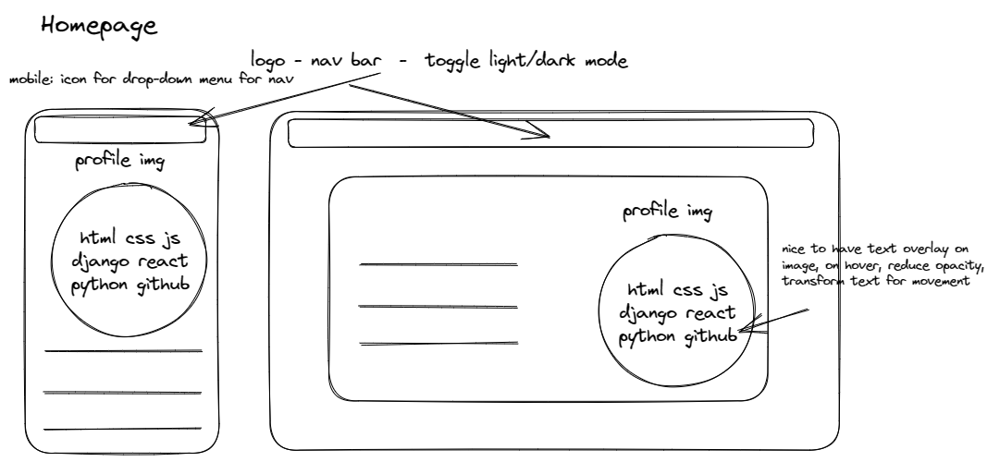
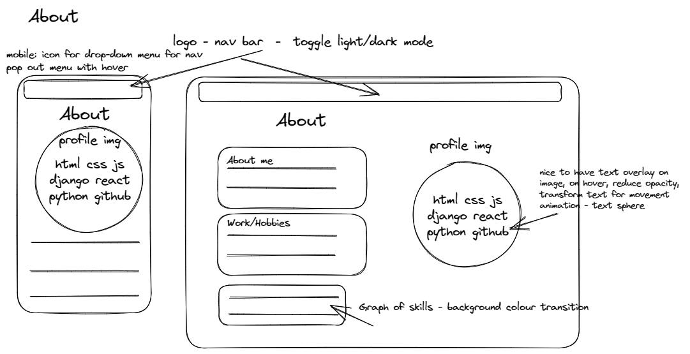
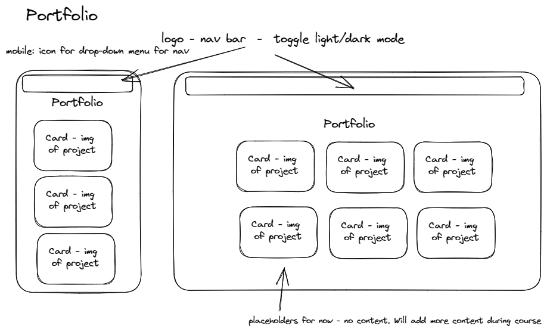
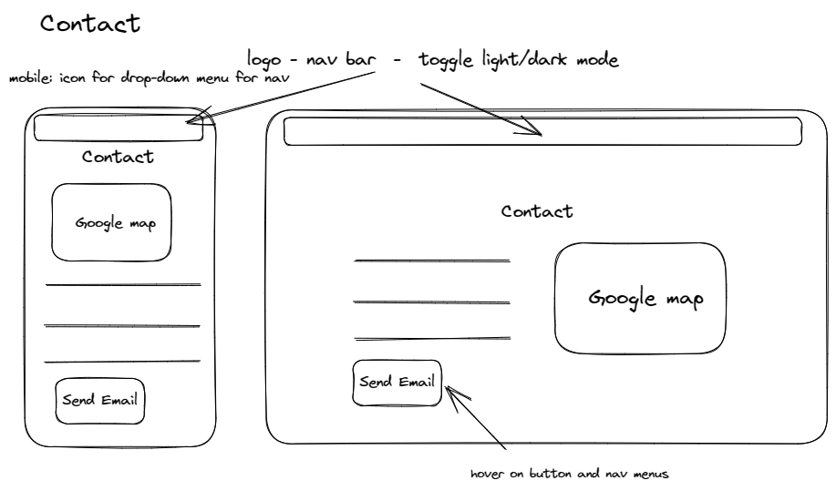

# Tracey Nguyen - Portfolio Task

[My portfolio site]( https://trace-n.github.io/Portfolio )

## Project Requirements

### Content

- The home page is the landing page with a profile picture.
- The biography is covered on the About page and also includes links to external reference sites that have helped with building the site
- The Contact page has a form to allow the user to send an email linked with Formspree so an email is received when the "Send Email" button is clicked as well as an embedded Google map
- The Portfolio page contains placeholders for upcoming projects from SheCodes

- [ ] At least one profile picture
- [ ] Biography (at least 100 words)
- [X] Functional Contact Form
- [X] "Projects" section
- [X] Links to external sites, e.g. GitHub and LinkedIn.

### Technical
 
- There are 4 web pages uploaded to GitHub
- Responsive design principles have been applied for different screen media widths for mobile and laptop. Refer to Bonus section for more details on responsiveness.
- Semantic HTML tags have been used for descriptive elements and to enable accessibility
- The site has been version controlled and published on GitHub

- [X] At least 2 web pages.
- [ ] Version controlled with Git
- [ ] Deployed on GitHub pages.
- [X] Implements responsive design principles.
- [X] Uses semantic HTML.

### Bonus (optional)

- Different styles exist for active, hover, focus and clicked states
- There is a toggle day/night button to change between light and dark mode
- Javascript has been incorporated to handle the mobile menu open and close, mobile menu icon change on click and toggle day/night button

- [X] Different styles for active, hover and focus states.
- [X] Include JavaScript to add some dynamic elements to your site.

### Desktop Screenshots> Please include the following:
> - The different pages and features of your website on mobile, tablet and desktop screen sizes (multiple screenshots per page and screen size).
> - The different features of your site, e.g. if you have hover states, take a screenshot that shows that.
>
> You can do this by saving the images in a folder in your repo, and including them in your readme document with the following Markdown code:

#### Homepage 

#### About Page

#### Portfolio Page

#### Contact Page

### Mobile Screenshots

#### Homepage 

#### About Page

#### Portfolio Page

#### Contact Page

### Wireframes

#### Homepage 

#### About Page

#### Portfolio Page

#### Contact Page

### Future Improvements

- Add transition to hamburger menu on svg icon change
- Add photo to portfolio page
- Add additional projects
- Link live GitHub to contacts svg icon