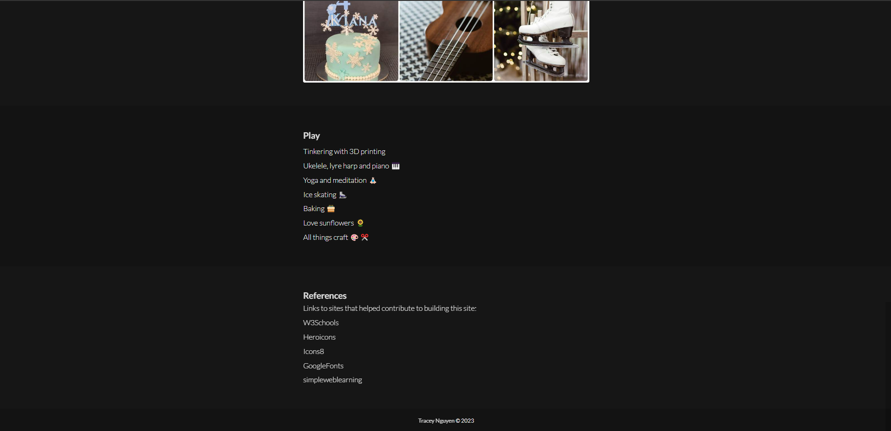
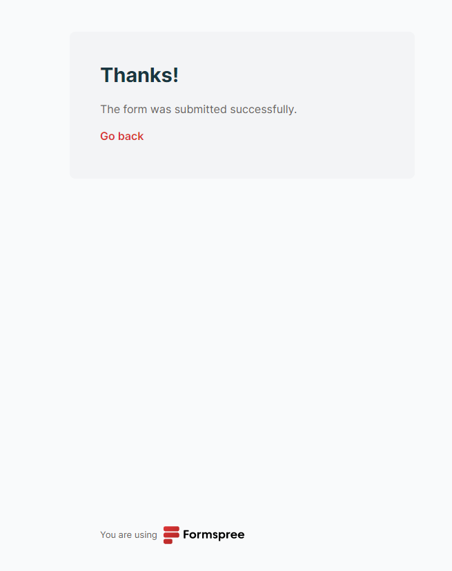
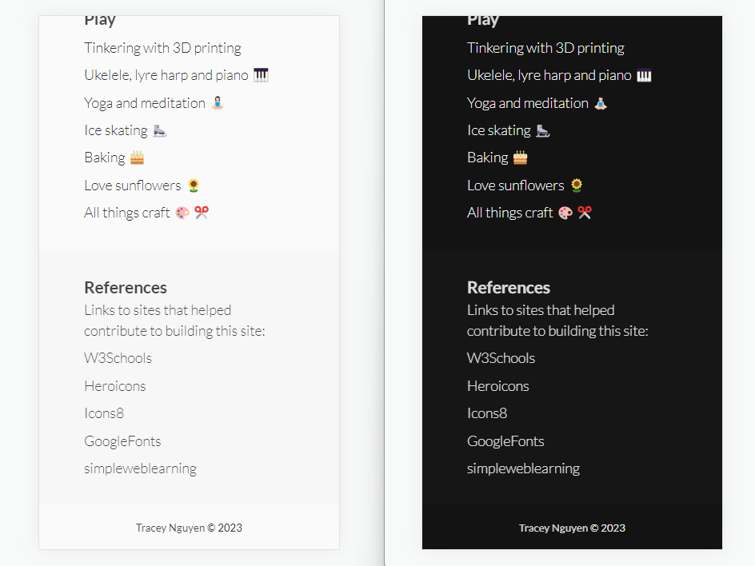

# Tracey Nguyen - Portfolio Task

[My portfolio site]( https://trace-n.github.io/Portfolio )

## Project Requirements

### Content

- The home page is the landing page with a profile picture
- In mobile mode, a profile picture appears with a header banner with falling text via CSS animation
- There is a brief description and a button to link to the About page
- In full screen mode, the profile picture is hidden and covered by svg icons that move with CSS transform animation on hover and reveal the hidden background image.
- The biography is covered on the About page and also includes links to external reference sites that have helped with building the site
- The Contact page has a form to allow the user to send an email linked with Formspree so an email is received when the "Send Email" button is clicked
- The Contact page contains an embedded Google map
- The Portfolio page contains placeholders for upcoming projects from SheCodes

- [X] At least one profile picture
- [X] Biography (at least 100 words)
- [X] Functional Contact Form
- [X] "Projects" section
- [X] Links to external sites, e.g. GitHub and LinkedIn.

### Technical
 
- There are 4 web pages uploaded to GitHub
- Responsive design principles have been applied for different screen media widths for mobile and laptop. Refer to Bonus section for more details on responsiveness.
- Semantic HTML tags have been used for descriptive elements and to enable accessibility
- The site has been version controlled and published on GitHub

- [X] At least 2 web pages.
- [X] Version controlled with Git
- [X] Deployed on GitHub pages.
- [X] Implements responsive design principles.
- [X] Uses semantic HTML.

### Bonus (optional)

- Different styles exist for active, hover, focus and clicked states
- There is a toggle day/night button to change between light and dark mode 
- Javascript has been incorporated to handle the mobile menu open and close, mobile menu icon change on click and toggle day/night button
- A javascript variable is held between pages to initialise the day/night theme toggle on different page navigation

- [X] Different styles for active, hover and focus states.
- [X] Include JavaScript to add some dynamic elements to your site.

### Desktop Screenshots> Please include the following:

#### Homepage 

#### About Page

#### Portfolio Page

#### Contact Page

### Mobile Screenshots

#### Homepage 

#### About Page

#### Portfolio Page

#### Contact Page

### Wireframes

#### Homepage 

#### About Page

#### Portfolio Page

#### Contact Page

### Future Improvements

- Add transition to hamburger menu on svg icon change
- Add additional projects